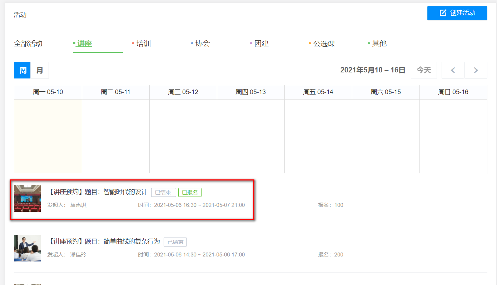
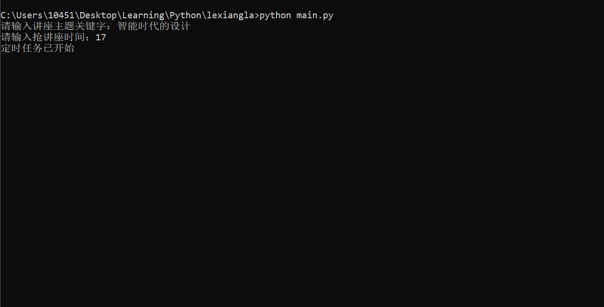

# lexiangla_Crawler  

# 背景   
    本项目用于抢企业微信腾讯乐享中的讲座资格
---  

# 安装  
>本项目使用`python` + `selenium`编写，需要如下相关包和驱动。
> 1. 下载项目后，解压项目，使用项目中的requirement安装所需的包和依赖。在python中使用命令`pip install -r requirement.txt` 进行安装
> 2. 下载浏览器驱动，本项目使用谷歌浏览器，需要下载与浏览器版本对应的驱动。[谷歌官方下载](https://chromedriver.chromium.org/downloads) 或[镜像下载](https://npm.taobao.org/mirrors/chromedriver)
> 3. 下载驱动压缩包后，解压驱动，然后将`chromedriver.exe`，放到与项目同一个目录中
--- 

# 使用  
在终端中输入命令运行程序
```angular2html
# python main.py
```
---  

# 示例  
1. 例如抢下图讲座

2. 打开终端进入项目所在，输入命令`python main.py`运行项目, 输入讲座标题，输入抢讲座时间，实例中输入17表示为定时到17点开始抢讲座
  
---  


